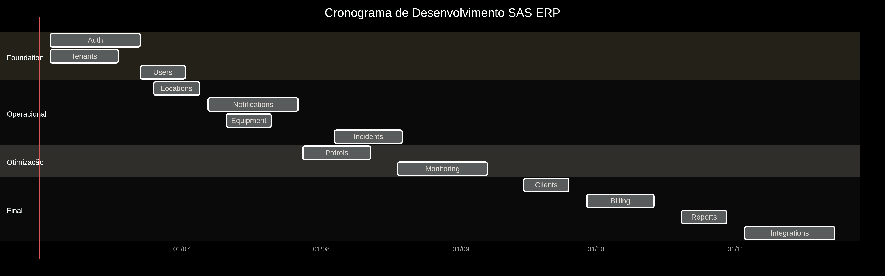
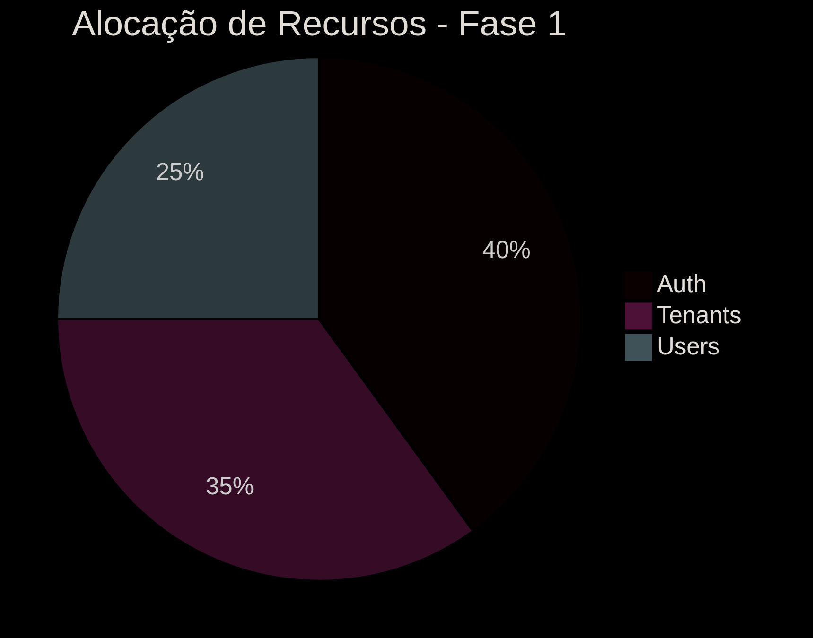
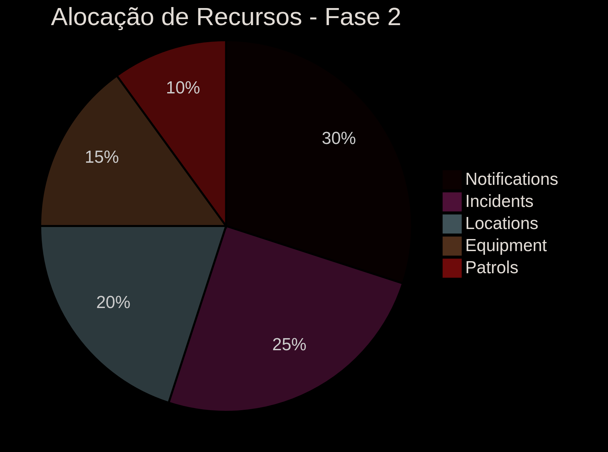
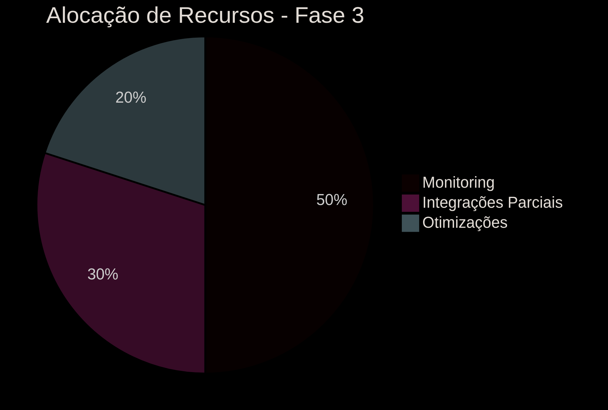
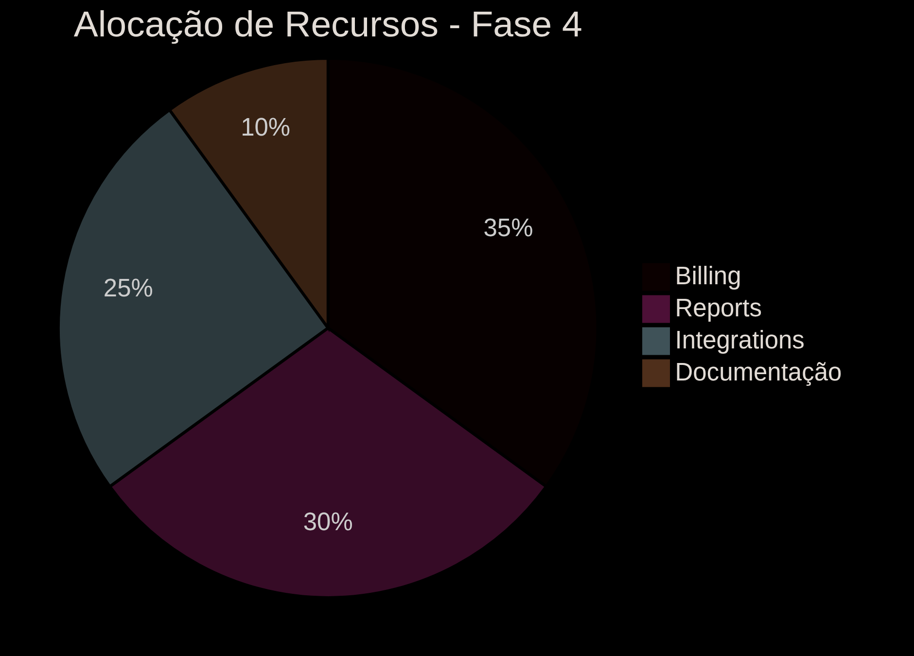

# SAS ERP - Sistema de Gestão para Segurança Patrimonial

## Visão Geral
Sistema modular multi-tenant para gestão integrada de operações de segurança patrimonial, desenvolvido em NestJS com arquitetura limpa.

---

## Módulos Principais

### 1. Módulo de Autenticação (`auth`)
**Descrição**:  
Responsável por todo o fluxo de autenticação e autorização do sistema.

**Funcionalidades**:
- Login com JWT
- Controle de acesso RBAC
- Gerenciamento de sessões
- Redefinição de senha

**Tempo de desenvolvimento**: 3-4 semanas

**Dependências**:
- `users` module

---

### 2. Módulo de Multi-Tenancy (`tenants`)
**Descrição**:  
Gerencia o isolamento de dados entre diferentes clientes (tenants).

**Funcionalidades**:
- Provisionamento de novos tenants
- Configurações por tenant
- Isolamento de schemas no PostgreSQL

**Tempo de desenvolvimento**: 2-3 semanas

**Dependências**:
- Core do sistema

---

### 3. Módulo de Usuários (`users`)
**Descrição**:  
Gerencia perfis de usuários e suas permissões.

**Funcionalidades**:
- CRUD de usuários
- Vinculação a tenants
- Atribuição de perfis

**Tempo de desenvolvimento**: 2 semanas

**Dependências**:
- `auth` module

---

### 4. Módulo de Notificações (`notifications`)
**Descrição**:  
Sistema centralizado de comunicação com usuários e sistemas.

**Funcionalidades**:
- Envio de e-mails/SMS/push
- Templates dinâmicos
- Filas prioritárias
- Histórico de notificações

**Tempo de desenvolvimento**: 3-4 semanas

**Dependências**:
- `users` module

---

### 5. Módulo de Incidentes (`incidents`)
**Descrição**:  
Registro e acompanhamento de ocorrências de segurança.

**Funcionalidades**:
- Criação de incidentes
- Classificação por gravidade
- Anexos de mídia
- Fluxo de resolução

**Tempo de desenvolvimento**: 3 semanas

**Dependências**:
- `notifications` module

---

### 6. Módulo de Localizações (`locations`)
**Descrição**:  
Gerencia as informações geográficas e estruturais dos locais monitorados.

**Funcionalidades**:
- Cadastro de locais (endereço, coordenadas)
- Hierarquia de locais (país, estado, cidade, propriedade, setor)
- Mapeamento de equipamentos por local
- Integração com serviços de geolocalização

**Tempo de desenvolvimento**: 2 semanas

**Dependências**:
- `tenants` module
- `clients` module

---

### 7. Módulo de Rondas (`patrols`)
**Descrição**:  
Gestão de rotinas de vigilância patrimonial.

**Funcionalidades**:
- Criação de rotas
- Checkpoints com QR Code
- Relatórios de conformidade

**Tempo de desenvolvimento**: 3 semanas

**Dependências**:
- `locations` module

---

### 8. Módulo de Monitoramento (`monitoring`)
**Descrição**:  
Dashboard em tempo real para central de segurança.

**Funcionalidades**:
- Integração com câmeras
- Disparo de alarmes
- Painel de eventos

**Tempo de desenvolvimento**: 4 semanas

**Dependências**:
- `incidents` module
- `locations` module

---

### 9. Módulo de Equipamentos (`equipment`)
**Descrição**:  
Cadastro e manutenção de dispositivos de segurança.

**Funcionalidades**:
- Inventário de equipamentos
- Agendamento de manutenção
- Histórico de status

**Tempo de desenvolvimento**: 2 semanas

**Dependências**:
- `locations` module

---

### 10. Módulo de Clientes (`clients`)
**Descrição**:  
Gestão de contratos e informações dos clientes.

**Funcionalidades**:
- Cadastro de clientes
- Gestão de contratos
- Documentos associados

**Tempo de desenvolvimento**: 1-2 semanas

**Dependências**:
- Core do sistema

---

### 11. Módulo de Faturamento (`billing`)
**Descrição**:  
Gestão financeira e cobrança de serviços.

**Funcionalidades**:
- Geração de faturas
- Integração com gateways de pagamento
- Relatórios financeiros

**Tempo de desenvolvimento**: 3 semanas

**Dependências**:
- `clients` module

---

### 12. Módulo de Relatórios (`reports`)
**Descrição**:  
Geração de relatórios operacionais e gerenciais.

**Funcionalidades**:
- Relatórios personalizados
- Exportação em múltiplos formatos
- Agendamento de envio

**Tempo de desenvolvimento**: 2 semanas

**Dependências**:
- Todos os módulos operacionais

---

### 13. Módulo de Integrações (`integrations`)
**Descrição**:  
Conexão com sistemas externos e APIs.

**Funcionalidades**:
- Webhooks
- API RESTful
- Integração com ERPs

**Tempo de desenvolvimento**: 3-4 semanas

**Dependências**:
- Core do sistema

---

## Cronograma de Desenvolvimento

| Fase | Módulos                     | Duração  |
|------|-----------------------------|----------|
| 1    | Auth + Tenants + Users      | 7 semanas|
| 2    | Notifications + Incidents   | 7 semanas|
| 3    | Locations + Patrols + Monitoring | 7 semanas |
| 4    | Equipment + Clients         | 3 semanas|
| 5    | Billing + Reports           | 5 semanas|
| 6    | Integrations                | 4 semanas|
| **Total**                     | **33 semanas** |

> **Nota**: Tempos estimados para um desenvolvedor Pleno em Node.js considerando:
> - 40 horas semanais
> - Complexidade média dos requisitos
> - Implementação de testes unitários e de integração

## Dependências Externas
```text
# Principais dependências
@nestjs/core
@nestjs/config
@nestjs/jwt
@nestjs/bull
prisma
twilio
socket.io
```
## Cronograma por Módulo e Fase

| Módulo          | Tarefas Principais                                                                 | Semanas | Período                   | Dependências          |
|-----------------|------------------------------------------------------------------------------------|---------|---------------------------|-----------------------|
| **Auth**        | JWT Implementation, RBAC System, Session Management, Password Recovery             | 4       | 02/06 - 27/06/2025        | -                    |
| **Tenants**     | Schema Isolation, Tenant Provisioning, Configuration Management                    | 3       | 02/06 - 20/06/2025        | -                    |
| **Users**       | User CRUD, Profile Management, Permission Assignment                               | 2       | 23/06 - 04/07/2025        | Auth                 |
| **Notifications**| Email/SMS/Push System, Template Engine, Priority Queues, History Tracking         | 4       | 07/07 - 01/08/2025        | Users                |
| **Incidents**   | Incident Reporting, Severity Classification, Media Attachments, Resolution Workflow| 3       | 04/08 - 22/08/2025        | Notifications        |
| **Locations**   | Hierarchy Management, Geolocation Services, Sector Mapping, Address Validation     | 2       | 25/06 - 08/07/2025        | Tenants, Clients     |
| **Equipment**   | Inventory Management, Maintenance Scheduling, Status Tracking                     | 2       | 11/07 - 25/07/2025        | Locations            |
| **Patrols**     | Route Planning, Checkpoint System (QR/NFC), Compliance Reporting                   | 3       | 28/07 - 15/08/2025        | Locations            |
| **Monitoring**  | Realtime Dashboard, Camera Integration, Alert System, Event Visualization          | 4       | 18/08 - 12/09/2025        | Incidents, Locations |
| **Clients**     | CRM Functionality, Contract Management, Document Storage                          | 2       | 15/09 - 26/09/2025        | -                    |
| **Billing**     | Invoice Generation, Payment Gateway Integration, Financial Reporting              | 3       | 29/09 - 17/10/2025        | Clients              |
| **Reports**     | Custom Report Builder, Multi-format Export, Scheduled Delivery                    | 2       | 20/10 - 31/10/2025        | Todos módulos        |
| **Integrations**| Webhooks System, API Gateway, ERP Connectors, Third-party APIs                    | 4       | 03/11 - 28/11/2025        | -                    |



### Fase 1: Foundation (02/06 - 04/07/2025)


### Fase 2: Operacional (07/07 - 22/08/2025)


### Fase 3: Otimização (25/06 - 12/09/2025)


### Fase 4: Final (15/09 - 28/11/2025)



